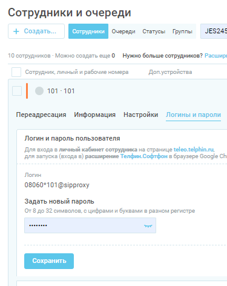

# Функциональный бот, который позволяет собирать cookie-токены из кабинетов селлеров

### Краткое описание

Бот, который реализован на базе Playwright, заходит в ЛК продавца, бродит по нужным страницам и получает
куки токены, которые потом сохраняет у нас в БД. Сами куки живут 1 месяц (не все), поэтому при актуальных токенах
аутентификация происходит по ним (хранение в MiniO), а если куки уже нерабочие, то через аутентификацию через смс.
СМС мы получаем из сервиса Телфин. Это виртуальная АТС. По АПИ получаем оттуда СМС с номера и парсим код для ВБ.
Для работы данного бота, необходимо отправить запрос на адрес: users/cabinet/bot/activation/ (смотрите в django) с
параметром.
is_wbtoken_bot_activated (True, False). Далее из нашей БД из номеров симбанка (устаревшее, но используемое название)
подберется рандомно номер телефона и происвоится клиенту. Клиенту надо будет этот номер добавить к себе в ЛК на WB,
чтобы у бота был доступ. Далее ловкость кода и никакого мошенничества.

#### MiniO
Хранилище: http://192.168.122.200:9000/buckets/wbtoken-cookie-bot/browse

#### Телфин
Быстрый старт: https://ringme-confluence.atlassian.net/wiki/spaces/Ringme/pages/1901920307  
АПИ Документация: https://www.telphin.ru/subscribers/documentation-rest-api  
АПИ Документация: https://apiproxy.telphin.ru/api/ver1.0/client_api_explorer/  

Чтобы видеть смс-ки надо установить (как вариант, это я использовал, можно и по-другому) расширение для chrome-браузера
https://clck.ru/37pznw  
Далее в ЛК (https://teleo.telphin.ru/staff_/) надо подключить расширение и после этого будут приходить смс в расширение.  
  
Перехват же СМС можно выполнить через АПИ.

### Что происходит?
Есть несколько сценариев данного репозитория:

1. Обновление supplier_id у всех наших селлеров. Это нужно, чтобы сам бот имел возможность зацепиться за этот параметр в
   БД и передать соответствующие токены
2. Обновление куки-токенов
3. Проверка селлера на корректное добавление нашего бота

### Локальный запуск
Образ получился довольно жирным, поэтому первый запуск (и вероятно перезапуск) будут очень долгими - около 6 минут.
Если запуск локальный и через докер и при этом для тестов, то сценарий запуска таков:
<code>docker build -f .\Dockerfile_test -t token --name token .</code>
<code>docker run token</code>
Если запуск без докера, то просто
<code>python3 dev_run.py</code>
Для запуска локально также надо отключать прокси (можно просто закомментировать) (особенно если виндоус ОС).
Иначе могут быть конфликты

### Список токенов, которые собираются текущим ботом

1. WBToken
    - С главной страницы = <code>WBToken_main</code>
    - Со страницы с рекламой (ВБ.Продвижение) = <code>WBToken_advert</code>
    - Со страницы с историей остатков из аналитики продавца = <code>WBToken_history</code>
    - Со страницы с финансовыми отчетами = <code>WBToken_report</code>
    - Со страницы с поставками и стоимостями и коэффициентами отгрузки на склады = <code>WBToken_supply</code>
    - Со страницы с акциями = <code>WBToken_promotion</code>
2. x_supplier_id

### Очередность и интервалы запуска

Все скрипты разбиты на 2 категории:

| Название группы раннеров                              | Краткое описание                                                                                                                                                                                                                  |                                  Интервал запуска | Время                      |
|:------------------------------------------------------|:----------------------------------------------------------------------------------------------------------------------------------------------------------------------------------------------------------------------------------|--------------------------------------------------:|----------------------------|
| UPDATE_SUPPLIER_ID                                    | Обновление supplier_id у всех наших селлеров. Обновление происходит в постгрес, чтобы цепляться для добавления токенов, и еще в кликхаусе, чтобы при парсинге товаров с ВБ определять является ли карточка нашего клиента или нет |                                       1 раз в час | Круглосуточно              |
| UPDATE_WBTOKENS_FROM_COOKIES__PLAYWRIGHT              | Обновление куки-токенов. Актуальная версия бота                                                                                                                                                                                   |                                    4 раза в сутки | 00:00, 06:00, 12:00, 18:00 |
| UPDATE_WBTOKENS_FROM_COOKIES__UNDETECTED_CHROMEDRIVER | Обновление куки-токенов. Неактуальная версия бота, работоспособная лишь локально, сохранена в качестве запасного варианта                                                                                                         |                                                 - | -                          |
| CHECK_PHONE_AND_SUPPLIER__PLAYWRIGHT                  | Проверка кабинета на то, что в список сотрудников добавлен наш бот                                                                                                                                                                | Принудительно в момент добавления бота в кабинете | -                          |

Приятного пользования!
